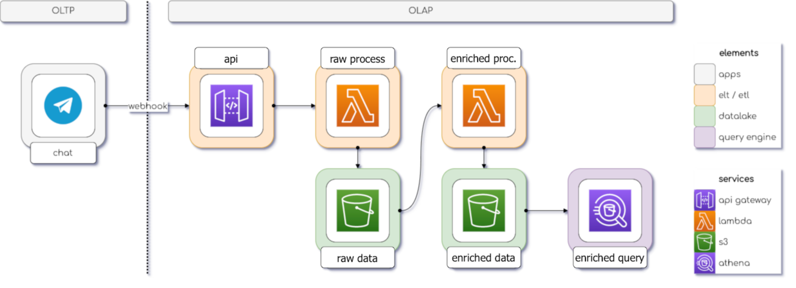

# Projeto-Pipeline-de-Dados-Telegram

# Data Pipeline Demo

> This project supported the [live](https://www.youtube.com/watch?v=RjAyrgzTPW4) bootcamp on how to develop OLAP systems.

## Architecture

**1.**  Ingestão de Dados: Utilizamos um bot no Telegram para captar mensagens, que são automaticamente armazenadas em um bucket no AWS S3. Isso garante a captura contínua e segura dos dados enviados pelos usuários.

**2.**  Transformação de Dados (ETL): Implementamos uma função no AWS Lambda para realizar o ETL (Extract, Transform, Load) dos dados. Isso incluiu limpeza, transformação e estruturação das mensagens capturadas para prepará-las para análise.

**3.**  Interação via API: Configuramos uma API web no AWS API Gateway para fornecer acesso aos dados processados. Essa API permite que outros sistemas e aplicações consultem e interajam com as informações coletadas do Telegram de maneira controlada e segura.

**4.**  Arquitetura Event-Driven: A infraestrutura foi projetada com base em eventos, utilizando webhooks da API de bots do Telegram. Isso significa que os sistemas reagem automaticamente a novas mensagens ou eventos no Telegram, garantindo uma resposta rápida e automatizada às interações dos usuários.

**5.**  Armazenamento e Consulta: Utilizamos o AWS Athena para criar uma camada de consulta sobre os dados armazenados no S3. Isso permitiu consultas SQL rápidas e eficientes sobre os dados do Telegram, sem a necessidade de processamento manual extensivo.

Este projeto integrado na AWS proporcionou uma solução robusta para ingestão, processamento e disponibilização de dados do Telegram, aproveitando os serviços gerenciados da AWS para escalabilidade, segurança e eficiência operacional.
